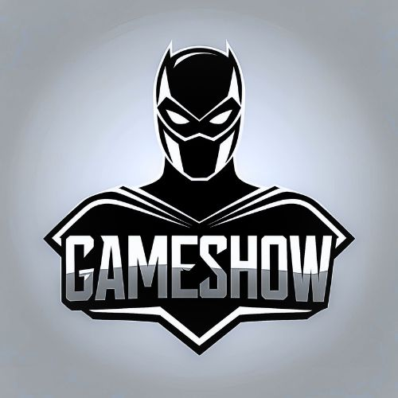
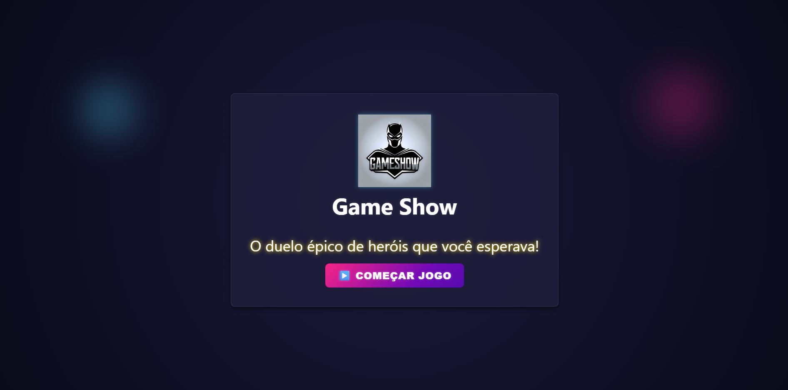
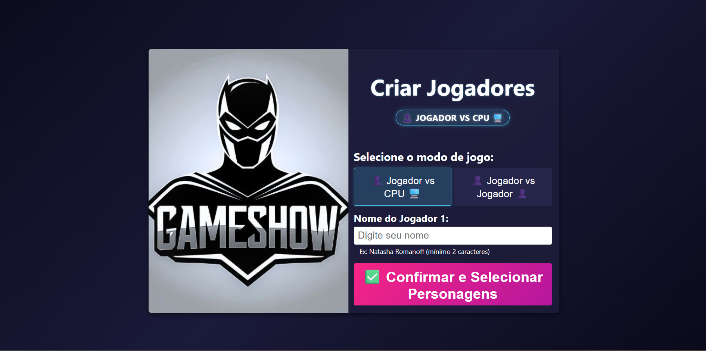
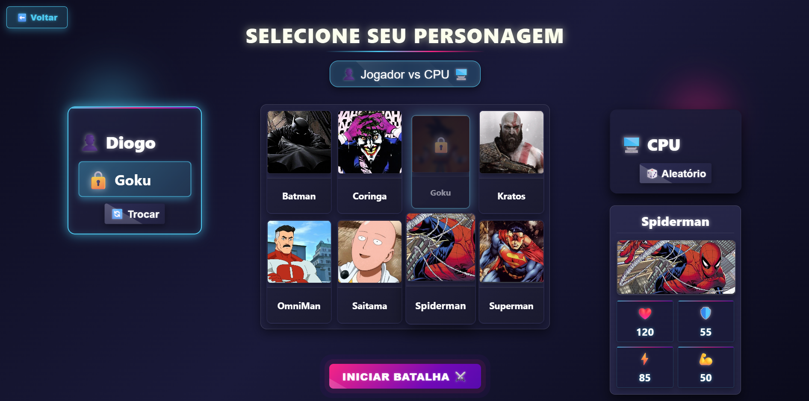
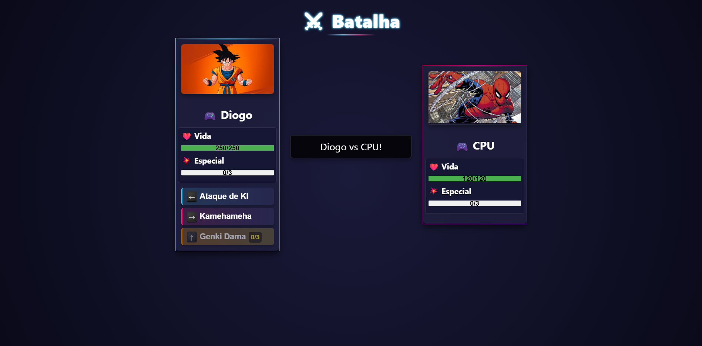
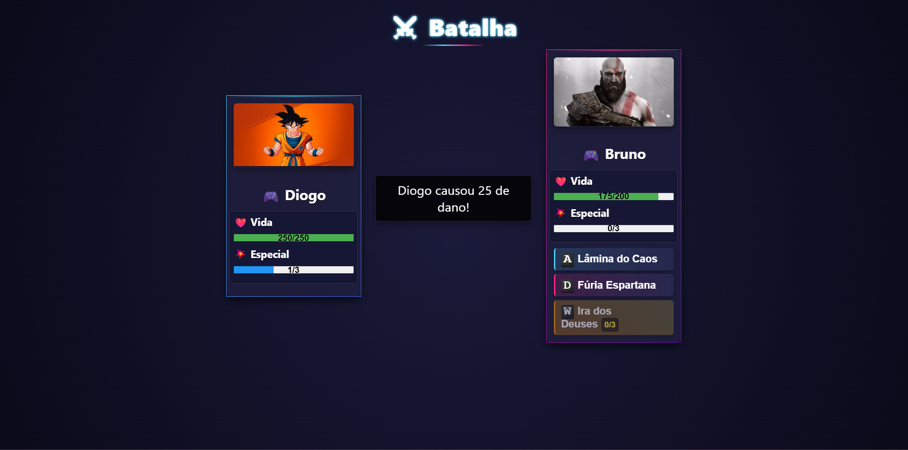
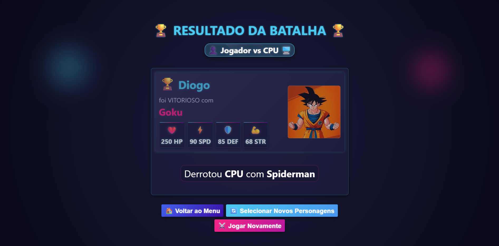

<!-- HEADER ANIMADO -->

<p align="center">
  
</p>

<p align="center">
  
</p>

<!-- BADGES -->

<p align="center">
  <a href="LICENSE"></a>
  
  
  
  
</p>

<p align="center">
  <picture>
    
  </picture>
</p>

---

## 🧭 Sumário

* [Sobre](#-sobre)
* [Destaques](#-destaques)
* [📸 Screenshots + Efeitos](#-screenshots--efeitos)
* [⚙️ Instalação](#️-instalação)
* [🎮 Como Jogar](#-como-jogar)
* [🧩 Estrutura do Projeto](#-estrutura-do-projeto)
* [🔌 API](#-api)
* [🛠️ Tecnologias](#️-tecnologias)
* [🗺️ Roadmap](#️-roadmap)
* [🤝 Contribuindo](#-contribuindo)
* [🧑‍💻 Autores](#-autores)
* [📄 Licença](#-licença)

---

## 🏟️ Sobre

Uma arena de batalha épica onde **heróis se enfrentam em combates por turnos**. Escolha seu campeão, **planeje ataques**, **gerencie precisão, esquiva e defesa** e conquiste o título de **campeão da arena**.

---

## ✨ Destaques

* **Turnos estratégicos** → Ataques *Básico*, *Rápido* e *Especial*
* **Mecânicas de combate** → Precisão, esquiva por velocidade e redução de dano por armadura
* **Heróis únicos** → Vida, Defesa, Velocidade e **ataques personalizados**
* **Animações/GIFs** por ação de combate
* **Stack moderno** → React + Node.js + PostgreSQL (Sequelize)

---

## 📸 Screenshots + Efeitos

<details>
  <summary><strong>🎬 Telas e GIFs de batalha (clique para expandir)</strong></summary>

  <p align="center">
      
      
      
      
      
      
  </p>
</details>

</details>

---

## ⚙️ Instalação

<details open>
  <summary><strong>📋 Pré-requisitos</strong></summary>

* Node.js **16+**
* PostgreSQL **15+**
* npm ou yarn

</details>

<details open>
  <summary><strong>📦 Backend</strong></summary>

```bash
# Clone o repositório
git clone https://github.com/DioCrM22/Game-Show.git
cd hero-battle-arena/backend

# Instale dependências
npm install

# Configure variáveis de ambiente
cp .env.example .env
# Edite com suas credenciais do PostgreSQL

# Execute migrations
npx sequelize-cli db:migrate

# Inicie o servidor
echo "http://localhost:3001" && npm run dev
```

</details>

<details open>
  <summary><strong>🎨 Frontend</strong></summary>

```bash
cd ../frontend

# Instale dependências
npm install

# Configure a API URL
cp .env.example .env
# Defina a URL do backend, ex.: VITE_API_URL=http://localhost:3001

# Inicie a aplicação
npm start
```

</details>

---

## 🎮 Como Jogar

<details open>
  <summary><strong>1) Seleção de Herói</strong></summary>
Cada herói possui **Vida**, **Defesa e **Velocidade** próprios e **ataques** com **dano/precisão** diferentes.
</details>

<details>
  <summary><strong>2) Modos de Jogo</strong></summary>

* 👥 **PVP**: contra outro jogador
* 🤖 **PVE**: contra CPU

</details>

<details>
  <summary><strong>3) Sistema de Turnos (exemplo)</strong></summary>

```javascript
// Fluxo de exemplo
Jogador 1 → Ataque Básico (←)
Jogador 2 → Ataque Rápido (→)
Jogador 1 → Ataque Especial (↑) // requer 3 cargas
```

</details>

<details>
  <summary><strong>4) Controles</strong></summary>

**Jogador 1**

* <kbd>←</kbd> Básico
* <kbd>→</kbd> Rápido
* <kbd>↑</kbd> Especial

**Jogador 2**

* <kbd>A</kbd> Básico
* <kbd>D</kbd> Rápido
* <kbd>W</kbd> Especial

</details>

---

## 🧩 Estrutura do Projeto

<details open>
  <summary><strong>Árvore de diretórios</strong></summary>

```text
hero-battle-arena/
├── backend/
│   ├── controllers/
│   │   └── battleController.js
│   ├── models/
│   │   ├── Player.js
│   │   ├── Hero.js
│   │   └── Battle.js
│   ├── routes/
│   │   └── battleRoutes.js
│   └── server.js
├── frontend/
│   ├── src/
│   │   ├── componentes/
│   │   │   └── BarraDeVida/
│   │   ├── paginas/
│   │   │   └── Batalha/
│   │   └── App.js
│   └── public/
└── README.md
```

</details>

---

## 🔌 API

<details open>
  <summary><strong>⚔️ Batalha</strong></summary>

* `POST /api/battle/start` → Inicia nova batalha
* `POST /api/battle/turn` → Executa turno de ataque
* `POST /api/battle/cpu-turn` → Turno automático da CPU
* `GET /api/battle/status/:id` → Status atual da batalha
* `GET /api/battle/history` → Histórico de batalhas
* `DELETE /api/battle/reset` → Reseta o histórico de batalhas (dev mode)
  
</details>

<details>
  <summary><strong>🦸 Heróis</strong></summary>

* `GET /api/heroes` → Lista todos os heróis
* `GET /api/heroes/:id` → Detalhes do herói
* `GET /api/heroes/random` → Retorna um herói aleatório
* `GET /api/heroes/:id/gifs` → Retorna GIFs de entrada, ataque, especial e vitória do herói
  
</details>

<details>
  <summary><strong>🎮 Jogadores</strong></summary>

* `GET /api/players` → Estatísticas gerais dos jogadores
* `POST /api/players` → Cria novo jogador
* `PUT /api/players/:id` → Atualiza informações do jogador
* `GET /api/players/ranking` → Ranking de vitórias
* `GET /api/players/check?name={nome}` → Verifica se nome já existe
  
</details>

---

## 🛠️ Tecnologias

**Frontend**

* React 18.2
* CSS3 + animações
* React Router DOM
* Suporte a teclado

**Backend**

* Node.js + Express
* PostgreSQL + Sequelize ORM
* Persistência de estatísticas
* WebSockets (planejado)

**DevOps**

* npm/yarn
* Scripts de migração
* CORS configurado

---

## 🗺️ Roadmap

* 🎭 Skins para heróis
* 🌐 Multiplayer em tempo real
* 📊 Ranking global
* 🎨 Mais efeitos e animações
* 📱 Versão mobile
* 🎵 Trilha e SFX
* 🏆 Torneios e eventos

---

## 🤝 Contribuindo

1. Faça o fork do projeto
2. Crie uma branch: `git checkout -b feature/AmazingFeature`
3. Commit: `git commit -m "feat: add AmazingFeature"`
4. Push: `git push origin feature/AmazingFeature`
5. Abra um Pull Request

> Consulte também: `CONTRIBUTING.md` e `CODE_OF_CONDUCT.md` (se aplicável)

---

## 🧑‍💻 Autores

* **Diogo Maia** – [@DioCrM22](https://github.com/DioCrM22)
* **Contribuidores** – Obrigado a todos!

---

## 📄 Licença

Este projeto está sob a licença **MIT** – veja o arquivo [LICENSE](LICENSE) para detalhes.

---

<!-- NOTAS DE USO
- Substitua caminhos/usuário, adicione suas imagens em frontend/public/images/...
- Para GIFs pesados, prefira seções colapsáveis (<details>) para manter o README leve.
- Evite usar CSS customizado: o GitHub sanitiza estilos; prefira recursos nativos (details/summary, picture, mermaid, badges SVG).
-->
